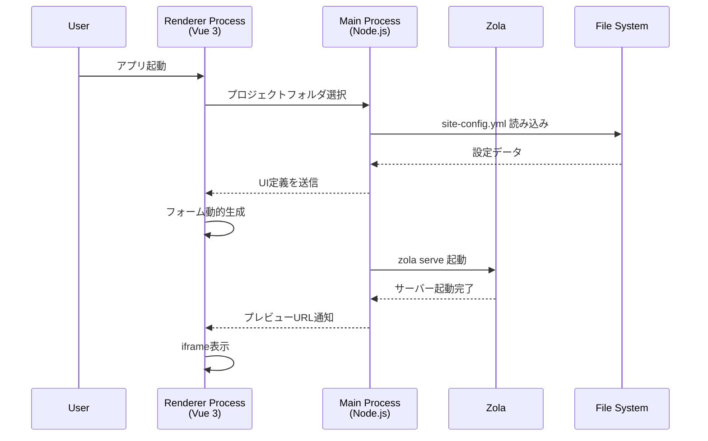
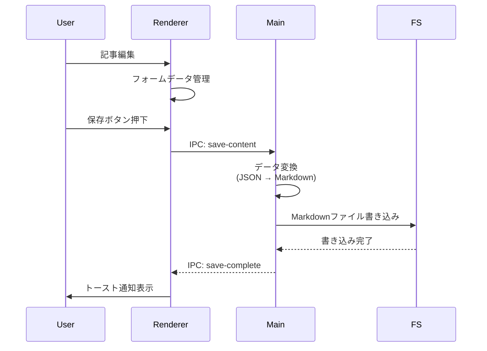
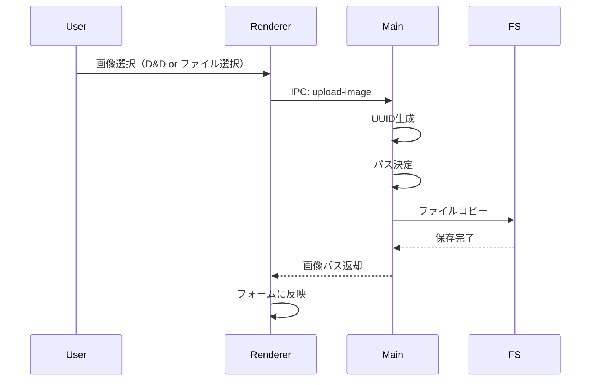
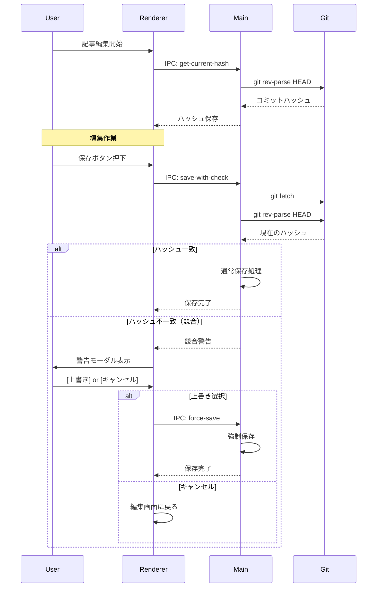

# Fubako アーキテクチャ・機能設計書

**バージョン:** 5.0.0 (Final)  
**最終更新:** 2025年11月24日

---

## 1. 技術スタック

| コンポーネント | 技術 | バージョン | 選定理由 |
|:---|:---|:---|:---|
| **App Shell** | Electron | 28.x | クロスプラットフォーム配布、ローカルFS操作権限。 |
| **Backend** | Node.js | 18.x | Electron Main Process。ファイルIO、Git操作担当。 |
| **Frontend** | Vue 3 + Vite | 3.x | 開発効率、コンポーネント設計の容易さ。 |
| **SSG Engine** | **Zola** | 0.18.x | Rust製シングルバイナリ。超高速、依存関係不要。 |
| **Template** | Tera | - | Zola標準。Jinja2/Liquidライクでデザイナーに親和性あり。 |
| **Editor** | TipTap | 2.x | Vue親和性が高いヘッドレスWYSIWYGエディタ。 |
| **Image** | Sharp | 0.33.x | 高速な画像リサイズ処理（Phase 2以降）。 |
| **YAML Parser** | js-yaml | 4.x | YAML ↔ JSON 変換ライブラリ。 |
| **Git** | simple-git | 3.x | Node.jsからGitコマンドを実行（Phase 2以降）。 |

---

## 2. システム連携フロー

### 2.1 起動〜プレビュー



**詳細フロー:**

1. **アプリ起動:**
   - Electron Main Process が起動
   - `app.on('ready')` でウィンドウ作成

2. **プロジェクト選択:**
   - Renderer から IPC 通信で `open-project` リクエスト
   - Main が `dialog.showOpenDialog()` でフォルダ選択ダイアログ表示
   - 選択されたパスを検証（`site-config.yml` の存在確認）

3. **設定読み込み:**
   ```javascript
   // Main Process
   const yaml = require('js-yaml');
   const fs = require('fs');
   
   function loadConfig(projectPath) {
     const configPath = path.join(projectPath, 'site-config.yml');
     const configYaml = fs.readFileSync(configPath, 'utf-8');
     const config = yaml.load(configYaml);
     return config;
   }
   ```

4. **Zola起動:**
   ```javascript
   const { spawn } = require('child_process');
   
   function startZola(projectPath) {
     const zolaPath = path.join(__dirname, 'bin/zola'); // バンドルされたバイナリ
     const zola = spawn(zolaPath, ['serve'], {
       cwd: projectPath,
       stdio: ['ignore', 'pipe', 'pipe']
     });
     
     // stdout, stderr を監視
     zola.stdout.on('data', (data) => {
       console.log(`Zola: ${data}`);
     });
     
     zola.stderr.on('data', (data) => {
       handleZolaError(data.toString());
     });
     
     return zola;
   }
   ```

5. **プレビュー表示:**
   - Renderer が `http://localhost:1111` を iframe で表示
   - ファイル変更を検知すると Zola が自動リビルド

---

### 2.2 編集〜保存



**詳細フロー:**

1. **フォーム入力:**
   - Vue 3 の Reactive State でデータ管理
   ```javascript
   // Renderer Process (Vue)
   const formData = reactive({
     title: '',
     date: new Date().toISOString().split('T')[0],
     'extra.thumbnail': '',
     '_content': ''
   });
   ```

2. **保存リクエスト:**
   ```javascript
   // Renderer Process
   async function saveContent() {
     const result = await window.electronAPI.saveContent({
       type: 'news',
       slug: 'my-article',
       data: toRaw(formData)
     });
     
     if (result.success) {
       showToast('保存しました');
     }
   }
   ```

3. **Main Process での変換:**
   ```javascript
   // Main Process
   ipcMain.handle('save-content', async (event, { type, slug, data }) => {
     try {
       // 1. _content 分離
       const { _content, ...frontmatterData } = data;
       
       // 2. 階層化
       const structured = structureData(frontmatterData);
       
       // 3. YAML生成
       const frontmatter = yaml.dump(structured);
       
       // 4. Markdown結合
       const markdown = `---\n${frontmatter}---\n\n${_content}`;
       
       // 5. ファイル書き込み
       const filePath = path.join(
         projectPath,
         config.content_types[type].folder,
         `${slug}.md`
       );
       
       fs.writeFileSync(filePath, markdown, 'utf-8');
       
       return { success: true };
     } catch (error) {
       return { success: false, error: error.message };
     }
   });
   ```

4. **データ構造化関数:**
   ```javascript
   function structureData(flatData) {
     const structured = {};
     
     for (const [key, value] of Object.entries(flatData)) {
       const keys = key.split('.');
       let current = structured;
       
       for (let i = 0; i < keys.length - 1; i++) {
         if (!current[keys[i]]) {
           current[keys[i]] = {};
         }
         current = current[keys[i]];
       }
       
       current[keys[keys.length - 1]] = value;
     }
     
     return structured;
   }
   ```

---

### 2.3 エラーハンドリング (Zola Build Error)

Zolaのビルドエラー（リンク切れ等）を検知し、ユーザーフレンドリーに表示する。

**Phase 1 実装:**

```javascript
// Main Process
const ERROR_PATTERNS = {
  brokenLink: {
    regex: /Broken link in (.+): tried to link to (.+)/,
    getMessage: (matches) => `${matches[1]} 内のリンク「${matches[2]}」が見つかりません`
  },
  frontmatterError: {
    regex: /Failed to parse front matter/,
    getMessage: () => '記事の設定データに誤りがあります。YAMLの形式を確認してください。'
  }
};

function handleZolaError(stderr) {
  // パターンマッチング
  for (const [type, pattern] of Object.entries(ERROR_PATTERNS)) {
    const match = stderr.match(pattern.regex);
    if (match) {
      const message = pattern.getMessage(match);
      sendToRenderer('zola-error', {
        type,
        message,
        raw: stderr
      });
      return;
    }
  }
  
  // 不明なエラー
  sendToRenderer('zola-error', {
    type: 'unknown',
    message: 'ビルドエラーが発生しました。プレビューを表示できません。',
    raw: stderr
  });
}
```

**Renderer での表示:**

```vue
<!-- Vue Component -->
<template>
  <div v-if="buildError" class="error-overlay">
    <div class="error-card">
      <h3>プレビューエラー</h3>
      <p>{{ buildError.message }}</p>
      <button @click="closeBuildError">閉じる</button>
      <details v-if="buildError.raw">
        <summary>詳細情報</summary>
        <pre>{{ buildError.raw }}</pre>
      </details>
    </div>
  </div>
</template>

<script setup>
import { ref, onMounted } from 'vue';

const buildError = ref(null);

onMounted(() => {
  window.electronAPI.onZolaError((error) => {
    buildError.value = error;
  });
});

function closeBuildError() {
  buildError.value = null;
}
</script>
```

**Phase 2以降で追加予定のエラーパターン:**

```javascript
const PHASE2_ERRORS = {
  templateNotFound: {
    regex: /Template '(.+)' not found/,
    getMessage: (matches) => `テンプレート「${matches[1]}」が見つかりません`
  },
  invalidDate: {
    regex: /Invalid date format in (.+)/,
    getMessage: (matches) => `${matches[1]} の日付形式が正しくありません`
  },
  imageNotFound: {
    regex: /Failed to read image (.+)/,
    getMessage: (matches) => `画像「${matches[1]}」が見つかりません`
  }
};
```

---

## 3. 画像管理ロジック

### 3.1 Phase 1: アップロード（リサイズなし）

**フロー:**



**実装:**

```javascript
// Main Process
const { v4: uuidv4 } = require('uuid');
const path = require('path');
const fs = require('fs');

ipcMain.handle('upload-image', async (event, { filePath }) => {
  try {
    // 1. UUID生成
    const uuid = uuidv4();
    const ext = path.extname(filePath);
    
    // 2. 保存先パス決定
    const now = new Date();
    const year = now.getFullYear();
    const month = String(now.getMonth() + 1).padStart(2, '0');
    
    const uploadDir = path.join(
      projectPath,
      'static/uploads',
      String(year),
      month
    );
    
    // 3. ディレクトリ作成（存在しない場合）
    fs.mkdirSync(uploadDir, { recursive: true });
    
    // 4. ファイル名決定
    const fileName = `${uuid}${ext}`;
    const destPath = path.join(uploadDir, fileName);
    
    // 5. ファイルコピー
    fs.copyFileSync(filePath, destPath);
    
    // 6. Markdown用のパス返却
    const publicPath = `/uploads/${year}/${month}/${fileName}`;
    
    return {
      success: true,
      path: publicPath,
      fileName: fileName
    };
  } catch (error) {
    return {
      success: false,
      error: error.message
    };
  }
});
```

**Phase 1 の制約:**
- リサイズなし（元ファイルをそのままコピー）
- ファイルサイズチェックなし
- 対応形式: jpg, jpeg, png, gif, webp（拡張子チェックのみ）

---

### 3.2 Phase 2以降: リサイズ実装

```javascript
// Main Process
const sharp = require('sharp');

ipcMain.handle('upload-image', async (event, { filePath, options }) => {
  try {
    const uuid = uuidv4();
    const now = new Date();
    const year = now.getFullYear();
    const month = String(now.getMonth() + 1).padStart(2, '0');
    
    const uploadDir = path.join(
      projectPath,
      'static/uploads',
      String(year),
      month
    );
    
    fs.mkdirSync(uploadDir, { recursive: true });
    
    // image_options が指定されている場合
    if (options && options.width) {
      const format = options.format || 'webp';
      const fileName = `${uuid}.${format}`;
      const destPath = path.join(uploadDir, fileName);
      
      await sharp(filePath)
        .resize(options.width, null, {
          fit: 'inside',
          withoutEnlargement: true
        })
        .toFormat(format)
        .toFile(destPath);
      
      // Thumbnail生成
      const thumbFileName = `${uuid}_thumb.${format}`;
      const thumbPath = path.join(uploadDir, thumbFileName);
      
      await sharp(filePath)
        .resize(400, null, {
          fit: 'inside',
          withoutEnlargement: true
        })
        .toFormat(format)
        .toFile(thumbPath);
      
      const publicPath = `/uploads/${year}/${month}/${fileName}`;
      
      return {
        success: true,
        path: publicPath,
        thumbnail: `/uploads/${year}/${month}/${thumbFileName}`
      };
    } else {
      // image_options なし: 長辺制限のみ
      const ext = path.extname(filePath).slice(1);
      const fileName = `${uuid}.${ext}`;
      const destPath = path.join(uploadDir, fileName);
      
      await sharp(filePath)
        .resize(2000, 2000, {
          fit: 'inside',
          withoutEnlargement: true
        })
        .toFile(destPath);
      
      const publicPath = `/uploads/${year}/${month}/${fileName}`;
      
      return {
        success: true,
        path: publicPath
      };
    }
  } catch (error) {
    return {
      success: false,
      error: error.message
    };
  }
});
```

---

### 3.3 削除（Phase 1: 物理削除なし）

**原則:** 記事から画像を削除しても、物理ファイルは削除しない。

**理由:**
- 複数記事からの参照を追跡するのは複雑
- 誤削除のリスクが高い
- Phase 1 では参照カウント機能を実装しない

**動作:**

```javascript
// Renderer Process
function removeImage(key) {
  // フォームデータから削除
  formData[key] = '';
  
  // 保存時にMarkdownのFrontmatterから該当パスが削除される
  // 物理ファイル（static/uploads/...）は残る
}
```

**Phase 2以降: メディアライブラリでの削除**

```javascript
// Main Process
ipcMain.handle('delete-image', async (event, { imagePath }) => {
  // 警告: この操作は取り消せません
  const confirmed = await dialog.showMessageBox({
    type: 'warning',
    message: '画像を完全に削除しますか？',
    detail: 'この操作は取り消せません。',
    buttons: ['キャンセル', '削除'],
    defaultId: 0,
    cancelId: 0
  });
  
  if (confirmed.response === 1) {
    const fullPath = path.join(projectPath, 'static', imagePath);
    fs.unlinkSync(fullPath);
    return { success: true };
  }
  
  return { success: false };
});
```

---

## 4. Git連携・排他制御 (Phase 2以降)

### 4.1 方針: "Last Write Wins" (後勝ち) + 警告

Phase 1 では Git 機能なし。Phase 2 以降で実装。

### 4.2 競合検知フロー



### 4.3 実装（Phase 2）

```javascript
// Main Process
const simpleGit = require('simple-git');
const git = simpleGit(projectPath);

// 編集開始時
ipcMain.handle('get-current-hash', async () => {
  const hash = await git.revparse(['HEAD']);
  return hash;
});

// 保存時
ipcMain.handle('save-with-check', async (event, { savedHash, type, slug, data }) => {
  try {
    // 1. リモート確認
    await git.fetch();
    
    // 2. 現在のハッシュ取得
    const currentHash = await git.revparse(['HEAD']);
    
    // 3. 競合チェック
    if (currentHash !== savedHash) {
      return {
        conflict: true,
        message: 'サーバー上のデータが更新されています。上書きしますか？'
      };
    }
    
    // 4. 通常保存
    await saveContent(type, slug, data);
    
    // 5. コミット
    await git.add('./*');
    await git.commit(`Update: ${type}/${slug}`);
    
    return { success: true };
  } catch (error) {
    return { success: false, error: error.message };
  }
});

// 強制保存
ipcMain.handle('force-save', async (event, { type, slug, data }) => {
  await saveContent(type, slug, data);
  await git.add('./*');
  await git.commit(`Force update: ${type}/${slug}`);
  return { success: true };
});

// デプロイ（公開）
ipcMain.handle('deploy', async () => {
  try {
    await git.push();
    return { success: true };
  } catch (error) {
    return { success: false, error: error.message };
  }
});
```

---

## 5. IPC通信インターフェース

### 5.1 Phase 1 実装APIリスト

**プロジェクト管理:**
- `open-project` → プロジェクトフォルダ選択
- `load-config` → site-config.yml 読み込み

**コンテンツ管理:**
- `list-contents` → 記事一覧取得
- `load-content` → 記事読み込み
- `save-content` → 記事保存
- `delete-content` → 記事削除

**画像管理:**
- `upload-image` → 画像アップロード
- `list-images` → 画像一覧取得

**プレビュー:**
- `start-preview` → Zola起動
- `stop-preview` → Zola停止
- `on-zola-error` → ビルドエラー通知（Main → Renderer）

### 5.2 Phase 2以降で追加

**Git連携:**
- `get-current-hash` → 現在のコミットハッシュ取得
- `save-with-check` → 競合チェック付き保存
- `force-save` → 強制上書き保存
- `deploy` → Git push実行

**画像管理:**
- `delete-image` → 物理ファイル削除

**設定:**
- `validate-config` → config.toml との整合性チェック

---

## 6. パフォーマンス最適化

### 6.1 Phase 1 での考慮事項

**ファイルIO:**
- 非同期読み書き（`fs.promises`）を使用
- 大量の記事がある場合でも、一覧取得は1秒以内

**Zolaビルド:**
- 差分ビルドのため、通常は数十ms〜数百ms
- 記事数が1000件を超えると遅延の可能性

### 6.2 Phase 2以降での最適化

**一覧画面:**
- ページネーション実装（1ページ50件）
- 仮想スクロール（無限スクロール）

**画像処理:**
- バックグラウンドでリサイズ処理
- プログレスバー表示

---

## 7. セキュリティ考慮事項

### 7.1 Phase 1

**ファイルアクセス制限:**
- プロジェクトフォルダ外へのアクセス禁止
- パストラバーサル攻撃対策（`path.resolve` 使用）

**画像アップロード:**
- 拡張子チェック（jpg, jpeg, png, gif, webp のみ）
- Phase 1 ではファイルサイズ制限なし（警告のみ）

### 7.2 Phase 2以降

**画像アップロード:**
- ファイルサイズ制限（10MB）
- MIMEタイプチェック
- 悪意あるファイルのスキャン

**Git認証:**
- SSH Key または Personal Access Token
- パスワードは平文保存しない（Electron Store 使用）

---

## 8. トラブルシューティング

### Q1. Zolaが起動しない

**原因:**
- バンドルされたZolaバイナリのパスが間違っている
- 実行権限がない（Linux/Mac）

**対策:**
```javascript
// バイナリのパス確認
const zolaPath = path.join(__dirname, '../bin/zola');
console.log('Zola path:', zolaPath);
console.log('Exists:', fs.existsSync(zolaPath));

// Linux/Mac: 実行権限付与
if (process.platform !== 'win32') {
  fs.chmodSync(zolaPath, 0o755);
}
```

### Q2. 画像がプレビューに表示されない

**原因:**
- パスが間違っている（`static/` を含めている）
- Zolaサーバーが起動していない

**対策:**
- Markdownに記述するパスは `/uploads/...`（`static/` なし）
- プレビューURL（`http://localhost:1111`）が正しいか確認

### Q3. 日本語ファイル名がエラーになる

**原因:**
- OSやファイルシステムの文字コード問題

**対策:**
- アプリが自動でUUIDにリネームするため、通常発生しない
- もし発生した場合は、アップロード処理のUUID生成部分を確認

---

## 9. まとめ

### Phase 1 アーキテクチャの特徴

✅ **実装済み:**
- Electron + Vue 3 + Zola の基本連携
- site-config.yml の動的UI生成
- Markdown (Frontmatter + Body) の保存・読み込み
- 画像アップロード（リサイズなし）
- 基本的なエラーハンドリング（3パターン）

❌ **未実装（Phase 2以降）:**
- Sharp による画像リサイズ
- Git連携（排他制御、デプロイ）
- taxonomies 対応
- メディアライブラリ画面
- config.toml 整合性チェック

### 開発の進め方

**Phase 1:**
1. Electron + Vue のボイラープレート構築
2. IPC通信の基本実装
3. Zolaプロセス管理
4. フォーム動的生成
5. Markdown読み書き実装
6. 画像アップロード（単純コピー）

**Phase 2:**
1. Sharp統合
2. Git連携
3. メディアライブラリ
4. エラーハンドリング強化
5. パッケージング（Electron Builder）

---

**本アーキテクチャに基づき、Phase 1 の実装を開始できます。**
