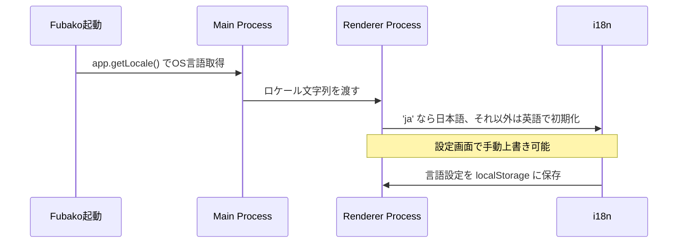

# Fubako 多言語対応設計ドキュメント

**バージョン:** 1.0.0
**最終更新:** 2026年2月20日
**ステータス:** Phase 2 設計確定

---

## 1. 方針

### 1.1 対応言語

| 言語 | 対象ユーザー | Phase |
|:---|:---|:---|
| 日本語（ja） | 国内クライアント（サイト更新者） | 1 |
| 英語（en） | 海外・国内エンジニア、OSS活動者、Zolaコミュニティ | 2 |

### 1.2 基本方針

- **Phase 1からキー方式で実装する。** 日本語のベタ書きは行わない。後から英語を追加するだけで済む構造を最初から維持する。
- **言語はOS設定から自動検出する。** `app.getLocale()`でOSの言語設定を取得し、起動時に自動で言語を切り替える。日本語以外は英語にフォールバックする。
- **設定画面で手動切り替えも可能にする。** 自動検出を上書きできるようにする。

### 1.3 フォールバック

```
OSの言語設定が 'ja' → 日本語
それ以外すべて → 英語（fallbackLocale）
```

日本語と英語以外のロケールは英語にフォールバックする。第3言語の追加はPhase 3以降で検討する。

---

## 2. 技術スタック

| ライブラリ | 用途 |
|:---|:---|
| vue-i18n | Vue 3向け国際化ライブラリ本体 |
| unplugin-vue-i18n | SFC内の`<i18n>`ブロック対応、翻訳ファイルの最適化 |

### 採用理由

- Vue 3との公式親和性が高い
- unplugin-vue-i18nによりコンポーネントごとに翻訳を管理できる
- Composition API（`useI18n`）との相性が良く、Vue 3のコードスタイルに統一できる

---

## 3. ファイル構成

```text
src/
├── i18n/
│   ├── index.ts          # i18n初期化・言語検出ロジック
│   └── locales/
│       ├── ja.json       # 日本語翻訳ファイル（Phase 1から用意）
│       └── en.json       # 英語翻訳ファイル（Phase 2で追加）
│
└── components/
    └── SomeComponent.vue # <i18n>ブロックでコンポーネント固有の翻訳も可
```

### 翻訳ファイルの構造方針

翻訳キーは機能・画面単位でネストして管理する。フラットなキー名は避ける。

```json
// ja.json（構造イメージ）
{
  "common": {
    "save": "保存",
    "publish": "公開",
    "cancel": "キャンセル",
    "delete": "削除"
  },
  "nav": {
    "dashboard": "ダッシュボード",
    "contents": "コンテンツ"
  },
  "editor": {
    "draft": "下書き",
    "published": "公開済み",
    "newArticle": "新規作成"
  },
  "messages": {
    "saveSuccess": "保存しました",
    "publishStart": "公開処理を開始しました。反映まで数分かかる場合があります。",
    "error": {
      "required": "{field}は必須項目です",
      "buildFailed": "ビルドエラーが発生しました。プレビューを表示できません。"
    }
  }
}
```

---

## 4. 言語検出フロー



**優先順位:**

1. ユーザーが設定画面で手動設定した言語（localStorageに保存）
2. OSの言語設定（`app.getLocale()`）
3. 英語（フォールバック）

---

## 5. 翻訳管理の運用方針

### Phase 1での作業

- `ja.json`のみ用意する
- `en.json`はキーだけ定義して値は空にしておく（または`ja.json`と同一内容）
- すべてのUIテキストを翻訳キー経由で記述する（ベタ書き禁止）

### Phase 2での作業

- `ja.json`の全キーを洗い出して英訳する
- `en.json`を完成させる
- 言語切り替えUIを設定画面に追加する

### 機能追加時のルール

新しいUIテキストを追加する際は必ず`ja.json`と`en.json`の両方に同時に追加する。どちらかだけ追加してフォールバックに頼る運用は行わない。

---

## 6. フェーズ別実装範囲

| 機能 | Phase 1 | Phase 2 | Phase 3以降 |
|:---|:---|:---|:---|
| 翻訳キー方式での実装 | ✅ | — | — |
| 日本語翻訳ファイル（ja.json） | ✅ | — | — |
| OS言語の自動検出 | ✅ | — | — |
| 英語翻訳ファイル（en.json） | ❌ | ✅ | — |
| 設定画面での手動言語切り替え | ❌ | ✅ | — |
| 第3言語対応 | ❌ | ❌ | 検討 |

---

**本ドキュメントに基づき、Phase 1からキー方式で実装を進める。**