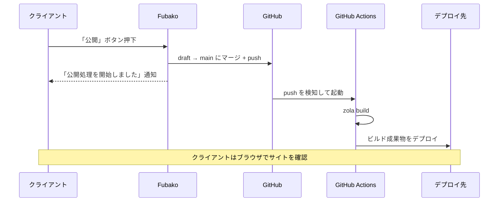

# Fubako CI/CD設計ドキュメント

**バージョン:** 1.0.0  
**最終更新:** 2026年2月19日  
**ステータス:** Phase 2 設計確定

---

## 1. 設計方針

### 1.1 基本方針

- **公開フローはgit pushに統一する。** デプロイ先（Netlify、AWS等）はGitHubリポジトリを監視して自動ビルド・デプロイする。Fubako側の実装はgit pushのみで完結する。
- **認証情報はGitHubに一元管理する。** デプロイ先のシークレットはGitHub Secretsに保存し、Fubakoアプリ内にはGitHubの認証情報のみを持たせる。
- **CIの設定ファイルはFubakoが生成してpushする。** エンジニアがFubakoのセットアップ画面で設定を入力し、対応するymlファイルを自動生成する。

### 1.2 公開フロー全体像



### 1.3 「公開完了」の検知について

git pushは即座に完了するが、実際のサイト反映はCI完了後（30秒〜数分）となる。CIの完了をFubakoが正確に検知することは、CDNキャッシュやサービスごとの差異により技術的に困難なため、以下の方針とする。

**Phase 2:** 「公開処理を開始しました。反映まで数分かかる場合があります」と通知し、サイトを確認するボタンを表示する。クライアントがブラウザで確認するのが最も確実な方法であるため、この導線を明示する。

**Phase 3:** GitHub APIによるCI状態ポーリングを検討する。

---

## 2. ブランチ戦略

### 2.1 基本構成

| ブランチ | 用途 | Fubakoの操作 |
|:---|:---|:---|
| `draft`（作業ブランチ） | 編集中コンテンツの保存先 | 「保存」でcommit + push |
| `main`（本番ブランチ） | 公開済みコンテンツ | 「公開」でdraft → mainにマージ + push |

ブランチ名は`site-config.yml`で変更可能。

```yaml
# site-config.yml
git:
  production_branch: "main"   # 本番ブランチ（CIのトリガーブランチ）
  working_branch: "draft"     # 作業ブランチ
```

### 2.2 操作と動作の対応

**「保存」ボタン:**
```
Markdownファイル書き込み
  → git add
  → git commit
  → git push origin draft
```

**「公開」ボタン:**
```
git checkout main
  → git merge draft
  → git push origin main   ← CIがこれを検知してビルド開始
  → git checkout draft
  → Fubako: 「公開処理を開始しました」通知
```

---

## 3. 認証設計

### 3.1 Fubakoアプリ内の認証情報

Fubakoが保持する認証情報はGitHubの認証情報のみとする。認証にはDugiteを使用し、Git Credential Manager（GCM）経由でGitHubアカウントと連携する。

```
Fubako（Dugite）
  → GCMがGitHub認証を処理
  → トークンの保存・更新・期限管理はGCMが担当
  → FubakoはGCMの存在を意識しない
```

クライアントはFubakoの設定画面でGitHubアカウントを選択するだけでよい。PATの手動発行は不要。

**Phase対応状況:**

| OS | Phase 2 | Phase 3以降 |
|:---|:---|:---|
| Windows | ✅ GCM標準搭載 | — |
| Mac | ❌ 未対応 | ✅ GCMインストール手順を整備 |

### 3.2 デプロイ先の認証情報

デプロイ先（Netlify、AWS等）の認証情報はGitHub Secretsに保存する。Fubakoアプリ側には持たせない。

**メリット:**
- チーム運用時、メンバーの追加・削除はGitHubのメンバー管理のみで完結する
- 退職者のアクセスはGitHubアカウントの無効化で即時遮断できる
- 各クライアントPCにデプロイ先の認証情報を個別設定する必要がない
- 認証情報の漏洩リスクがFubakoアプリ側に生じない

**GitHub Secretsへの登録はエンジニアが初回セットアップ時に手動で行う。**（GitHub Pages以外のデプロイ先のみ必要）

| デプロイ先 | 必要なSecrets | GitHub Pagesとの差異 |
|:---|:---|:---|
| GitHub Pages | なし（`GITHUB_TOKEN`が自動付与） | 追加作業不要 |
| Netlify | `NETLIFY_AUTH_TOKEN`、`NETLIFY_SITE_ID` | 手動登録が必要 |
| AWS Amplify | リポジトリ連携のみ（Secretsは基本不要） | Amplifyコンソールでの設定が必要 |

---

## 4. CIファイルの自動生成

### 4.1 概要

Fubakoはセットアップ時にCIファイルを自動生成してリポジトリにpushする。エンジニアはFubakoのUI上で設定を入力するだけでよい。

**生成されるファイル:**

```
.github/
  workflows/
    deploy.yml        # デプロイワークフロー
  dependabot.yml      # Dependabot設定
```

### 4.2 セットアップUI

```
デプロイ設定
┌─────────────────────────────────────┐
│ デプロイ先                           │
│ ● GitHub Pages                      │
│ ○ Netlify                           │
│ ○ AWS Amplify                       │
│                                     │
│ 本番ブランチ名                       │
│ [main          ]                    │
│                                     │
│ 作業ブランチ名                       │
│ [draft         ]                    │
│                                     │
│ Zolaバージョン                       │
│ [0.19.2        ]                    │
│                                     │
│          [CIファイルを生成してpush]   │
└─────────────────────────────────────┘
```

### 4.3 生成されるCIファイル

#### GitHub Pages選択時

**`.github/workflows/deploy.yml`:**
```yaml
name: Deploy to GitHub Pages

on:
  push:
    branches: [main]  # 本番ブランチ名に応じて変更

jobs:
  deploy:
    runs-on: ubuntu-latest
    permissions:
      contents: write

    steps:
      - uses: actions/checkout@v4

      - name: Install Zola
        uses: taiki-e/install-action@v2
        with:
          tool: zola@0.19.2  # Zolaバージョンに応じて変更

      - name: Build
        run: zola build

      - name: Deploy
        uses: peaceiris/actions-gh-pages@v4
        with:
          github_token: ${{ secrets.GITHUB_TOKEN }}
          publish_dir: ./public
```

#### Netlify選択時

**`.github/workflows/deploy.yml`:**
```yaml
name: Deploy to Netlify

on:
  push:
    branches: [main]

jobs:
  deploy:
    runs-on: ubuntu-latest

    steps:
      - uses: actions/checkout@v4

      - name: Install Zola
        uses: taiki-e/install-action@v2
        with:
          tool: zola@0.19.2

      - name: Build
        run: zola build

      - name: Deploy
        uses: netlify/actions/cli@master
        with:
          args: deploy --prod --dir=public
        env:
          NETLIFY_AUTH_TOKEN: ${{ secrets.NETLIFY_AUTH_TOKEN }}
          NETLIFY_SITE_ID: ${{ secrets.NETLIFY_SITE_ID }}
```

#### AWS Amplify選択時

AWS AmplifyはGitHubリポジトリ連携によってCI/CDを自動構成するため、GitHub Actions用のymlは不要。代わりにAmplifyのビルド設定ファイルを生成する。

**`amplify.yml`:**
```yaml
version: 1
frontend:
  phases:
    build:
      commands:
        - curl -sL https://github.com/getzola/zola/releases/download/v0.19.2/zola-v0.19.2-x86_64-unknown-linux-gnu.tar.gz | tar xz
        - ./zola build
  artifacts:
    baseDirectory: public
    files:
      - '**/*'
  cache:
    paths: []
```

#### 共通: Dependabot設定

**`.github/dependabot.yml`:**（デプロイ先に関わらず全ケースで生成）
```yaml
version: 2
updates:
  - package-ecosystem: "github-actions"
    directory: "/"
    schedule:
      interval: "monthly"
    labels:
      - "ci"
```

---

## 5. セキュリティ

### 5.1 対策方針

CIファイルに関するセキュリティ対策として以下を実施する。

**ActionのバージョンアップデートはDependabotに委ねる。** Dependabotが月次でActionの更新PRを自動作成する。エンジニアがPRを確認してマージするだけでよい。Fubakoがymlを能動的に更新しにいく仕組みは実装しない（複雑さに対してメリットが少ない）。

**Zolaのバージョンはセットアップ時に明示的に固定する。** `zola@latest`は使用せず、エンジニアがセットアップ画面で指定したバージョンを固定記述する。意図しないバージョンアップを防ぎ、ビルド結果の再現性を保証する。

### 5.2 対策範囲

| リスク | 対策 | Phase |
|:---|:---|:---|
| サードパーティActionの脆弱性 | Dependabotで月次自動PR | 2 |
| Zolaの意図しないバージョンアップ | バージョン固定 | 2 |
| デプロイ先認証情報の漏洩 | GitHub Secretsに一元管理 | 2 |
| リポジトリへの不正アクセス | GitHubアカウントのセキュリティに委ねる（2FA等） | 対象外 |

---

## 6. エンジニア（導入者）の初回セットアップ手順

Fubakoを使ってクライアントのサイトを構築する際に、エンジニアが一度だけ行う作業の概要。

**全デプロイ先共通:**
1. クライアントのGitHubアカウントでリポジトリを作成
2. Fubakoのデプロイ設定画面で設定を入力
3. FubakoがCIファイルを生成してpush

**Netlify選択時（追加作業）:**
1. Netlifyでサイトを作成しSite IDを取得
2. NetlifyでAuth Tokenを発行
3. GitHubリポジトリのSecretsに`NETLIFY_AUTH_TOKEN`と`NETLIFY_SITE_ID`を登録

**AWS Amplify選択時（追加作業）:**
1. AmplifyコンソールでGitHubリポジトリを連携
2. ビルド設定を確認（`amplify.yml`が自動認識される）

**GitHub Pages選択時（追加作業）:**
- なし（`GITHUB_TOKEN`は自動付与されるため）

---

## 7. フェーズ別実装範囲

| 機能 | Phase 2 | Phase 3以降 |
|:---|:---|:---|
| git push による公開 | ✅ | — |
| ブランチ戦略（draft/main） | ✅ | — |
| CIファイルの自動生成（GitHub Pages / Netlify / AWS） | ✅ | — |
| Dependabot設定の自動生成 | ✅ | — |
| 「公開処理を開始しました」通知 + サイト確認ボタン | ✅ | — |
| Mac対応（GCM） | ❌ | ✅ |
| CI完了のポーリング検知 | ❌ | ✅ |
| Vercel対応 | ❌ | ✅ |

---

**本ドキュメントに基づき、Phase 2のCI/CD実装を開始できます。**